# Entity-Relationship Diagram (ERD) — Current Implemented Schema

## Purpose

This document provides the authoritative Entity-Relationship Diagram (ERD) for the Zero Brokerage platform representing the actual implemented database schema across migrations `20260925_001` through `20260930_005`.

---

## 1. Schema Diagram (Mermaid)

```mermaid
erDiagram
    SCHEMA_MIGRATIONS {
        VARCHAR_255 id PK "Primary Key (Migration identifier)"
        TIMESTAMPTZ applied_at "NOT NULL DEFAULT NOW()"
        VARCHAR_64 checksum "Nullable SHA-256 hex digest"
    }

    AUTH_IDENTITIES {
        UUID id PK "DEFAULT gen_random_uuid()"
        VARCHAR_20 phone UK "NOT NULL UNIQUE (+91...)"
        VARCHAR_30 status "NOT NULL DEFAULT 'ACTIVE' (ACTIVE, SUSPENDED, DELETION_PENDING, DELETED)"
        VARCHAR_30 role "NOT NULL DEFAULT 'USER' (USER, INDEPENDENT_BROKER, AGENCY_BROKER, AGENCY_ADMIN, SUPER_ADMIN)"
        TIMESTAMPTZ created_at "NOT NULL DEFAULT NOW()"
        TIMESTAMPTZ updated_at "NOT NULL DEFAULT NOW()"
        TIMESTAMPTZ deleted_at "NULL"
        TIMESTAMPTZ deletion_scheduled_at "NULL"
    }

    USER_PROFILES {
        UUID user_id PK,FK "REFERENCES auth_identities(id) ON DELETE CASCADE"
        VARCHAR_100 full_name "NULL"
        VARCHAR_255 email "NULL"
        TEXT avatar_url "NULL"
        JSONB preferences "NOT NULL DEFAULT '{}'"
        TIMESTAMPTZ created_at "NOT NULL DEFAULT NOW()"
        TIMESTAMPTZ updated_at "NOT NULL DEFAULT NOW()"
    }

    AUTH_SESSIONS {
        UUID id PK "DEFAULT gen_random_uuid()"
        UUID user_id FK "NOT NULL REFERENCES auth_identities(id) ON DELETE CASCADE"
        VARCHAR_128 refresh_token_hash UK "NOT NULL UNIQUE"
        VARCHAR_255 device_info "NULL"
        VARCHAR_45 ip_address "NULL"
        TEXT user_agent "NULL"
        TIMESTAMPTZ expires_at "NOT NULL"
        TIMESTAMPTZ last_used_at "NOT NULL DEFAULT NOW()"
        TIMESTAMPTZ revoked_at "NULL"
        VARCHAR_100 revocation_reason "NULL"
        TIMESTAMPTZ created_at "NOT NULL DEFAULT NOW()"
    }

    AUTH_OTP_CHALLENGES {
        UUID id PK "DEFAULT gen_random_uuid()"
        VARCHAR_20 phone "NOT NULL"
        VARCHAR_50 purpose "NOT NULL DEFAULT 'AUTHENTICATION' (AUTHENTICATION, CHANGE_PHONE, SENSITIVE_ACTION, ACCOUNT_DELETION)"
        VARCHAR_128 code_hash "NOT NULL"
        TIMESTAMPTZ expires_at "NOT NULL"
        INTEGER attempts "NOT NULL DEFAULT 0"
        INTEGER max_attempts "NOT NULL DEFAULT 3"
        VARCHAR_20 status "NOT NULL DEFAULT 'PENDING' (PENDING, VERIFIED, EXPIRED, FAILED, SUPERSEDED)"
        TIMESTAMPTZ consumed_at "NULL"
        VARCHAR_45 ip_address "NULL"
        TEXT user_agent "NULL"
        TIMESTAMPTZ created_at "NOT NULL DEFAULT NOW()"
    }

    AUTH_SECURITY_EVENTS {
        UUID id PK "DEFAULT gen_random_uuid()"
        VARCHAR_50 event_type "NOT NULL"
        UUID user_id FK "NULL REFERENCES auth_identities(id) ON DELETE SET NULL"
        VARCHAR_45 ip_address "NULL"
        TEXT user_agent "NULL"
        JSONB metadata "NOT NULL DEFAULT '{}'"
        TIMESTAMPTZ created_at "NOT NULL DEFAULT NOW()"
    }

    AGENCIES {
        UUID id PK "DEFAULT gen_random_uuid()"
        VARCHAR_255 name "NOT NULL"
        VARCHAR_255 slug UK "NOT NULL UNIQUE via uq_agencies_slug"
        VARCHAR_255 legal_name "NULL"
        VARCHAR_100 license_number "NULL"
        VARCHAR_30 status "NOT NULL DEFAULT 'ACTIVE' (ACTIVE, PENDING_VERIFICATION, SUSPENDED, TERMINATED)"
        VARCHAR_255 email "NULL"
        VARCHAR_20 phone "NULL"
        VARCHAR_255 address_line_1 "NULL"
        VARCHAR_255 address_line_2 "NULL"
        VARCHAR_100 city "NULL"
        VARCHAR_100 state "NULL"
        VARCHAR_20 postal_code "NULL"
        VARCHAR_2 country_code "NOT NULL DEFAULT 'IN'"
        TIMESTAMPTZ created_at "NOT NULL DEFAULT NOW()"
        TIMESTAMPTZ updated_at "NOT NULL DEFAULT NOW()"
        TIMESTAMPTZ deleted_at "NULL"
    }

    AGENCY_MEMBERSHIPS {
        UUID id PK "DEFAULT gen_random_uuid()"
        UUID agency_id FK "NOT NULL REFERENCES agencies(id) ON DELETE RESTRICT"
        UUID user_id FK "NOT NULL REFERENCES auth_identities(id) ON DELETE CASCADE"
        VARCHAR_30 role "NOT NULL DEFAULT 'MEMBER' (ADMIN, MANAGER, BROKER, MEMBER, AGENCY_OWNER)"
        VARCHAR_30 status "NOT NULL DEFAULT 'ACTIVE' (ACTIVE, INVITED, SUSPENDED, TERMINATED)"
        TIMESTAMPTZ created_at "NOT NULL DEFAULT NOW()"
        TIMESTAMPTZ updated_at "NOT NULL DEFAULT NOW()"
    }

    BROKER_VERIFICATIONS {
        UUID id PK "DEFAULT gen_random_uuid()"
        UUID user_id UK,FK "NOT NULL UNIQUE REFERENCES auth_identities(id) ON DELETE CASCADE"
        VARCHAR_30 status "NOT NULL DEFAULT 'UNSUBMITTED' (UNSUBMITTED, PENDING, APPROVED, REJECTED, SUSPENDED, REVERIFICATION_REQUIRED)"
        VARCHAR_100 license_number "NULL"
        JSONB document_urls "NOT NULL DEFAULT '[]'"
        TEXT rejection_reason "NULL"
        UUID reviewed_by FK "NULL REFERENCES auth_identities(id) ON DELETE SET NULL"
        TIMESTAMPTZ reviewed_at "NULL"
        TIMESTAMPTZ created_at "NOT NULL DEFAULT NOW()"
        TIMESTAMPTZ updated_at "NOT NULL DEFAULT NOW()"
    }

    OUTBOX_EVENTS {
        UUID id PK "DEFAULT gen_random_uuid()"
        VARCHAR_100 event_name "NOT NULL"
        INTEGER schema_version "NOT NULL DEFAULT 1"
        VARCHAR_100 aggregate_id "NOT NULL"
        VARCHAR_100 correlation_id "NOT NULL"
        VARCHAR_100 causation_id "NULL"
        JSONB actor "NULL"
        JSONB ownership "NULL"
        JSONB payload "NOT NULL"
        VARCHAR_30 status "NOT NULL DEFAULT 'PENDING' (PENDING, PROCESSING, PUBLISHED, FAILED, DEAD_LETTER)"
        INTEGER attempt_count "NOT NULL DEFAULT 0"
        INTEGER max_attempts "NOT NULL DEFAULT 5"
        TIMESTAMPTZ available_at "NOT NULL DEFAULT NOW()"
        TIMESTAMPTZ claimed_at "NULL"
        VARCHAR_100 claimed_by "NULL"
        TIMESTAMPTZ processed_at "NULL"
        TEXT last_error "NULL"
        TIMESTAMPTZ occurred_at "NOT NULL DEFAULT NOW()"
        TIMESTAMPTZ created_at "NOT NULL DEFAULT NOW()"
        TIMESTAMPTZ updated_at "NOT NULL DEFAULT NOW()"
    }

    PROPERTIES {
        UUID id PK "DEFAULT gen_random_uuid()"
        VARCHAR_50 property_type "NOT NULL (RESIDENTIAL, COMMERCIAL, LAND)"
        VARCHAR_50 sub_type "NOT NULL (APARTMENT, PENTHOUSE, VILLA, BUILDER_FLOOR, OFFICE, CO_WORKING, RETAIL, COMMERCIAL_BUILDING, AGRICULTURAL_LAND, INDUSTRIAL_PLOT, COMMERCIAL_PLOT)"
        VARCHAR_255 title "NULL"
        VARCHAR_255 address_line_1 "NOT NULL"
        VARCHAR_255 address_line_2 "NULL"
        VARCHAR_100 locality "NOT NULL"
        VARCHAR_100 city "NOT NULL"
        VARCHAR_100 state "NOT NULL"
        VARCHAR_20 postal_code "NOT NULL"
        VARCHAR_2 country_code "NOT NULL DEFAULT 'IN'"
        DOUBLE_PRECISION latitude "NOT NULL CHECK (latitude >= -90.0 AND latitude <= 90.0)"
        DOUBLE_PRECISION longitude "NOT NULL CHECK (longitude >= -180.0 AND longitude <= 180.0)"
        GEOGRAPHY location "NOT NULL geography(Point, 4326)"
        NUMERIC built_up_area "NULL NUMERIC(10,2) CHECK (> 0)"
        NUMERIC carpet_area "NULL NUMERIC(10,2) CHECK (> 0)"
        NUMERIC plot_area "NULL NUMERIC(10,2) CHECK (> 0)"
        VARCHAR_20 area_unit "NOT NULL DEFAULT 'SQ_FT' (SQ_FT, SQ_M, ACRES, HECTARES, SQ_YD)"
        INTEGER bedroom_count "NULL CHECK (>= 0)"
        INTEGER bathroom_count "NULL CHECK (>= 0)"
        INTEGER balcony_count "NULL CHECK (>= 0)"
        INTEGER floor_number "NULL"
        INTEGER total_floors "NULL CHECK (>= 0)"
        VARCHAR_30 furnishing_status "NULL (UNFURNISHED, SEMI_FURNISHED, FULLY_FURNISHED)"
        JSONB amenities "NOT NULL DEFAULT '[]'"
        JSONB attributes "NOT NULL DEFAULT '{}'"
        TIMESTAMPTZ created_at "NOT NULL DEFAULT NOW()"
        TIMESTAMPTZ updated_at "NOT NULL DEFAULT NOW()"
        TIMESTAMPTZ deleted_at "NULL"
    }

    LISTINGS {
        UUID id PK "DEFAULT gen_random_uuid()"
        UUID property_id FK "NOT NULL REFERENCES properties(id) ON DELETE RESTRICT"
        VARCHAR_30 owner_type "NOT NULL (INDEPENDENT_BROKER, AGENCY, DIRECT_OWNER)"
        UUID agency_id FK "NULL REFERENCES agencies(id) ON DELETE RESTRICT"
        UUID broker_id FK "NULL REFERENCES auth_identities(id) ON DELETE RESTRICT"
        VARCHAR_30 listing_intent "NOT NULL (SALE, RENT, LEASE)"
        VARCHAR_255 title "NULL"
        TEXT description "NULL"
        BIGINT price_minor "NOT NULL DEFAULT 0 CHECK (price_minor >= 0)"
        VARCHAR_3 currency "NOT NULL DEFAULT 'INR' CHECK (length(currency) = 3)"
        VARCHAR_20 price_period "NULL (MONTHLY, YEARLY, DAILY, ONE_TIME)"
        BIGINT security_deposit_minor "NULL CHECK (>= 0)"
        BIGINT maintenance_fee_minor "NULL CHECK (>= 0)"
        BOOLEAN is_negotiable "NOT NULL DEFAULT FALSE"
        DATE available_from "NULL"
        VARCHAR_30 status "NOT NULL DEFAULT 'DRAFT' (DRAFT, PENDING_VERIFICATION, PENDING_MODERATION, PUBLISHED, SUSPENDED, EXPIRED, ARCHIVED, REJECTED, WITHDRAWN)"
        BOOLEAN is_verified "NOT NULL DEFAULT FALSE"
        BOOLEAN is_featured "NOT NULL DEFAULT FALSE"
        UUID created_by FK "NOT NULL REFERENCES auth_identities(id) ON DELETE RESTRICT"
        UUID updated_by FK "NULL REFERENCES auth_identities(id) ON DELETE RESTRICT"
        TIMESTAMPTZ published_at "NULL"
        TIMESTAMPTZ expires_at "NULL"
        TIMESTAMPTZ archived_at "NULL"
        TIMESTAMPTZ created_at "NOT NULL DEFAULT NOW()"
        TIMESTAMPTZ updated_at "NOT NULL DEFAULT NOW()"
    }

    %% Relationships
    AUTH_IDENTITIES ||--o| USER_PROFILES : "1:1 profile (CASCADE)"
    AUTH_IDENTITIES ||--o{ AUTH_SESSIONS : "1:N sessions (CASCADE)"
    AUTH_IDENTITIES ||--o{ AUTH_SECURITY_EVENTS : "1:N audit logs (SET NULL)"
    AUTH_IDENTITIES ||--o{ AGENCY_MEMBERSHIPS : "1:N memberships (CASCADE)"
    AUTH_IDENTITIES ||--o| BROKER_VERIFICATIONS : "1:1 verification (CASCADE)"
    AUTH_IDENTITIES ||--o{ LISTINGS : "1:N broker listings (RESTRICT)"
    AUTH_IDENTITIES ||--o{ LISTINGS : "1:N created listings (RESTRICT)"

    AGENCIES ||--o{ AGENCY_MEMBERSHIPS : "1:N members (RESTRICT)"
    AGENCIES ||--o{ LISTINGS : "1:N managed listings (RESTRICT)"

    PROPERTIES ||--o{ LISTINGS : "1:N commercial offers (RESTRICT)"
```

---

## 2. Table-by-Table Referential Integrity & Constraints Summary

| Child Table | Foreign Key Column | Target Table | On Delete Action | Enforcing Migration | Notes / Unique Invariants |
| :--- | :--- | :--- | :--- | :--- | :--- |
| `user_profiles` | `user_id` (PK) | `auth_identities(id)` | `CASCADE` | `20260928_002` | `user_id` is both PK and FK; enforces strict 1:1 relationship. |
| `auth_sessions` | `user_id` | `auth_identities(id)` | `CASCADE` | `20260928_002` | Token hash unique (`refresh_token_hash UNIQUE`). |
| `auth_security_events` | `user_id` | `auth_identities(id)` | `SET NULL` | `20260928_002` | Preserves audit trail when user accounts are anonymized. |
| `agency_memberships` | `agency_id` | `agencies(id)` | `RESTRICT` | `20260930_004` | Added via constraint `fk_agency_memberships_agency`. |
| `agency_memberships` | `user_id` | `auth_identities(id)` | `CASCADE` | `20260928_002` | Invariant: `uq_agency_active_owner`, `uq_user_active_membership`. |
| `broker_verifications` | `user_id` (UK) | `auth_identities(id)` | `CASCADE` | `20260928_002` | 1:1 relationship via `user_id UNIQUE`. |
| `broker_verifications` | `reviewed_by` | `auth_identities(id)` | `SET NULL` | `20260928_002` | Preserves review timestamp even if reviewer account changes. |
| `listings` | `property_id` | `properties(id)` | `RESTRICT` | `20260930_004` | Property cannot be deleted while referenced by listing. |
| `listings` | `agency_id` | `agencies(id)` | `RESTRICT` | `20260930_004` | Agency cannot be deleted while referenced by listing. |
| `listings` | `broker_id` | `auth_identities(id)` | `RESTRICT` | `20260930_004` | Identity existence boundary check. |
| `listings` | `created_by` | `auth_identities(id)` | `RESTRICT` | `20260930_004` | Audit attribution. |
| `listings` | `updated_by` | `auth_identities(id)` | `RESTRICT` | `20260930_004` | Audit attribution. |

---

## 3. Database Check & Spatial Constraints Present

- **`chk_properties_coordinate_consistency`** (Migration 005): Enforces `abs(ST_Y(location::geometry) - latitude) < 0.000001 AND abs(ST_X(location::geometry) - longitude) < 0.000001`.
- **`chk_properties_latitude` / `chk_properties_longitude`** (Migration 004): Range bounds `[-90, 90]` and `[-180, 180]`.
- **`chk_listings_price_minor`** (Migration 005): `price_minor >= 0`.
- **`chk_listings_security_deposit_minor`** (Migration 005): `security_deposit_minor IS NULL OR security_deposit_minor >= 0`.
- **`chk_listings_maintenance_fee_minor`** (Migration 005): `maintenance_fee_minor IS NULL OR maintenance_fee_minor >= 0`.
- **`chk_listings_currency_code`** (Migration 005): `length(currency) = 3`.
- **`chk_listings_agency_owner_requires_agency`** (Migration 004): `owner_type != 'AGENCY' OR agency_id IS NOT NULL`.
- **`chk_listings_broker_owner_requires_broker`** (Migration 004): `owner_type != 'INDEPENDENT_BROKER' OR broker_id IS NOT NULL`.
- **`uq_agency_active_owner`** (Migration 004): Partial unique index `agency_memberships(agency_id) WHERE (role = 'AGENCY_OWNER' AND status = 'ACTIVE')`.
- **`uq_user_active_membership`** (Migration 004): Partial unique index `agency_memberships(user_id) WHERE (status = 'ACTIVE')`.
