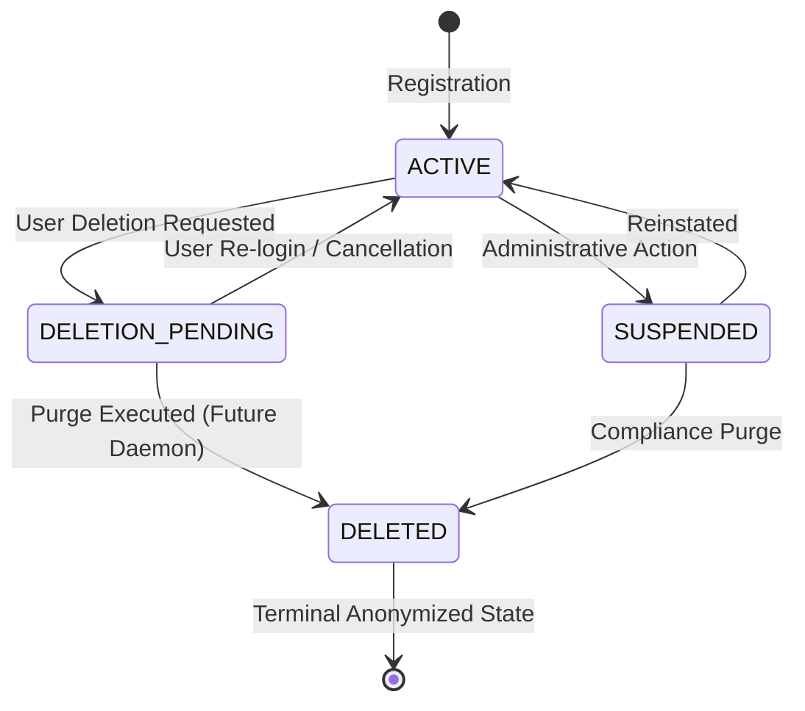
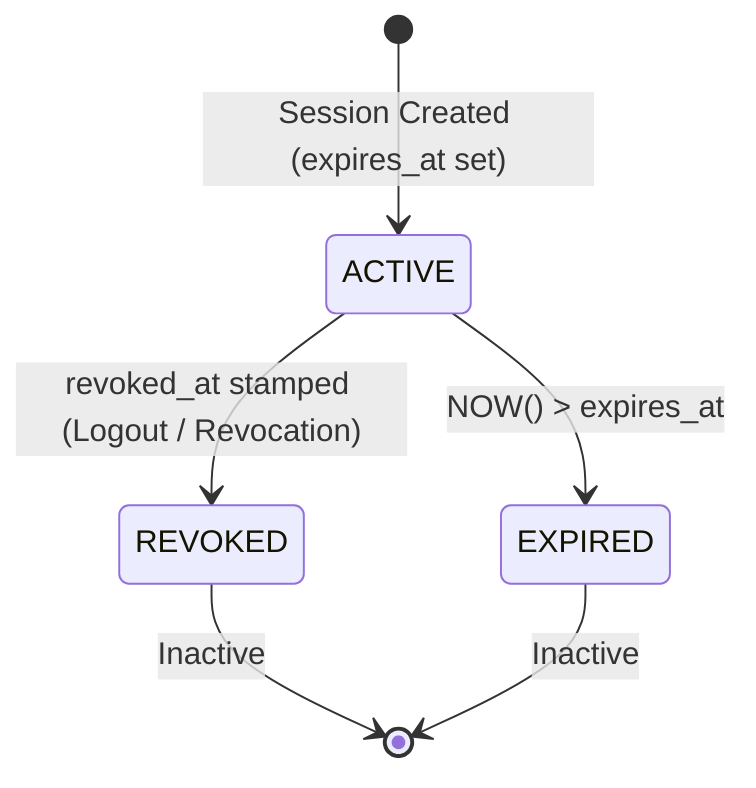
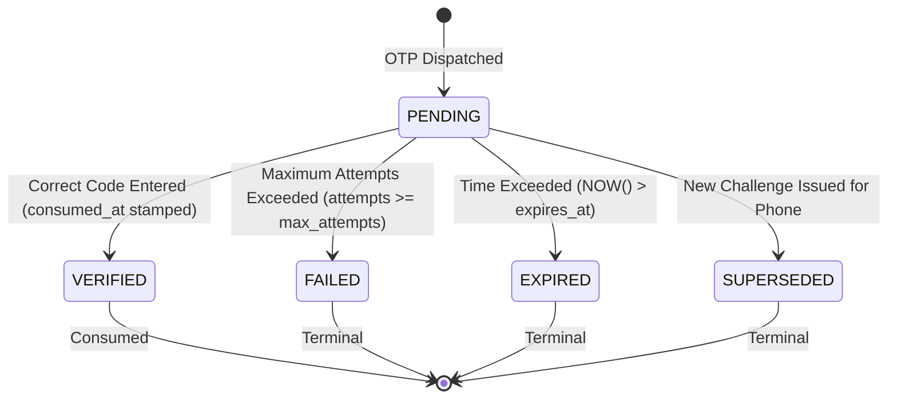
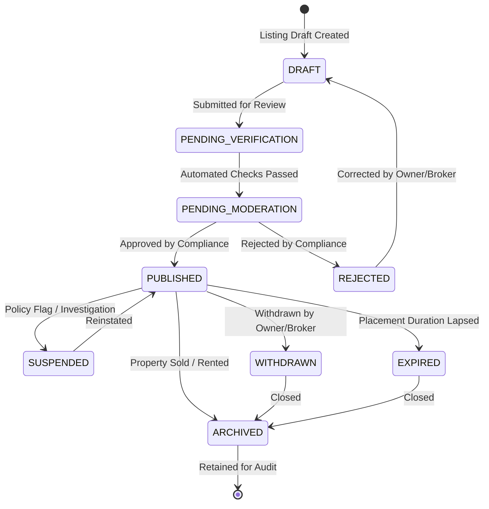
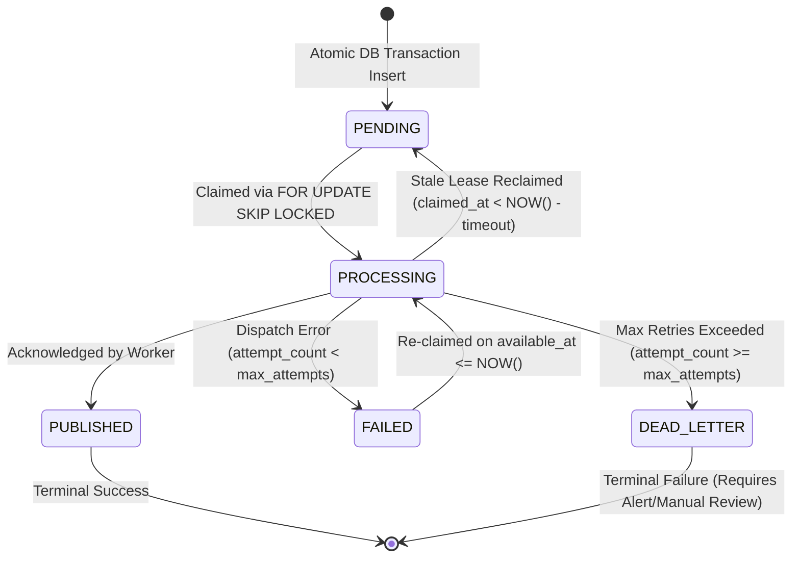

# Status Transition Data Model Policy

## Purpose

This document defines the lifecycle status transitions, state machine models, and concurrency guards for entities in the Zero Brokerage database. It distinguishes **implemented persistence constraints** (Step 03) from **future domain application workflows** (Steps 06, 07, 08, 11).

---

## 1. Principles of State Machine Governance

1. **Explicit Enumeration via Database Constraints**:
   - Status columns are strictly constrained to fixed enumerations via PostgreSQL `CHECK` constraints. Arbitrary string insertion is rejected at the database engine level.
2. **Guarded State Transitions**:
   - Status mutations must never execute via unconditional `UPDATE ... SET status = $newStatus`.
   - Transitions must be guarded by conditional SQL statements (e.g., `WHERE id = $id AND status = $expectedOldStatus`) or validated within application domain transactions.
3. **Auditability & Reason Capture**:
   - Rejection, failure, or revocation transitions record timestamps and metadata where schema columns exist (e.g. `rejection_reason`, `last_error`, `revocation_reason`).
4. **Boundary Distinction**:
   - **Step 03 Implemented Persistence**: PostgreSQL `CHECK` constraints, default values, and conditional update queries implemented in database migrations.
   - **Future Application Workflows**: Moderation pipelines, admin review queues, verification workflows, and automated cron daemons belong to subsequent domain steps (e.g., Step 07 for listing moderation, Step 06 for outbox dispatchers).

---

## 2. Implemented Entity Status State Machines

### 2.1 Identity (`auth_identities.status`)
- **Permissible Values**: `'ACTIVE'`, `'SUSPENDED'`, `'DELETION_PENDING'`, `'DELETED'`
- **Database Constraint**: `CHECK (status IN ('ACTIVE', 'SUSPENDED', 'DELETION_PENDING', 'DELETED'))`

| Current Status | Target Status | Triggering Action | Context & Implementation Status |
| :--- | :--- | :--- | :--- |
| *Initial* | `ACTIVE` | Phone registration / OTP verification | Default value on row insertion |
| `ACTIVE` | `SUSPENDED` | Security flag / administrative suspension | Service update guarded by `status = 'ACTIVE'` |
| `SUSPENDED` | `ACTIVE` | Administrative review approval | Service update guarded by `status = 'SUSPENDED'` |
| `ACTIVE` | `DELETION_PENDING` | Account deletion requested | Sets `deletion_scheduled_at` to a future timestamp (duration is an open policy) |
| `DELETION_PENDING` | `ACTIVE` | Account deletion cancelled | Clears `deletion_scheduled_at` |
| `DELETION_PENDING` | `DELETED` | Permanent purge execution | Sets `deleted_at = NOW()`, scrubs PII (Future Step 12 daemon) |

*Forbidden Transitions*: `DELETED` is terminal and cannot transition to any other status.

---

### 2.2 Sessions (`auth_sessions` Derived Lifecycle)
- **Schema Representation**: Migration `20260928_002` does not store a dedicated status string column. Instead, session validity is **derived** from temporal and revocation columns:
  - **`ACTIVE`**: `revoked_at IS NULL AND expires_at > NOW()`
  - **`REVOKED`**: `revoked_at IS NOT NULL` (records optional `revocation_reason`)
  - **`EXPIRED`**: `expires_at <= NOW()`

---

### 2.3 OTP Challenges (`auth_otp_challenges.status`)
- **Permissible Values**: `'PENDING'`, `'VERIFIED'`, `'EXPIRED'`, `'FAILED'`, `'SUPERSEDED'`
- **Database Constraint**: `CHECK (status IN ('PENDING', 'VERIFIED', 'EXPIRED', 'FAILED', 'SUPERSEDED'))`

---

### 2.4 Agencies (`agencies.status`)
- **Permissible Values**: `'ACTIVE'`, `'PENDING_VERIFICATION'`, `'SUSPENDED'`, `'TERMINATED'`
- **Database Constraint**: `CHECK (status IN ('ACTIVE', 'PENDING_VERIFICATION', 'SUSPENDED', 'TERMINATED'))`

*Implementation Note*: Migration `20260930_004` establishes the valid status enumeration. Business workflows governing verification onboarding and administrative suspension belong to the Agencies domain services.

---

### 2.5 Agency Memberships (`agency_memberships.status`)
- **Permissible Values**: `'ACTIVE'`, `'INVITED'`, `'SUSPENDED'`, `'TERMINATED'`
- **Database Constraint**: `CHECK (status IN ('ACTIVE', 'INVITED', 'SUSPENDED', 'TERMINATED'))`

*Concurrency & Integrity Invariants*:
- Database partial unique index `uq_user_active_membership` permits a user to hold at most **one** membership with `status = 'ACTIVE'`.
- Database partial unique index `uq_agency_active_owner` permits an agency to have at most **one** membership with `role = 'AGENCY_OWNER' AND status = 'ACTIVE'`.
- Status transitions to `ACTIVE` fail at the database level if an active record already exists.

---

### 2.6 Broker Verifications (`broker_verifications.status`)
- **Permissible Values**: `'UNSUBMITTED'`, `'PENDING'`, `'APPROVED'`, `'REJECTED'`, `'SUSPENDED'`, `'REVERIFICATION_REQUIRED'`
- **Database Constraint**: `CHECK (status IN ('UNSUBMITTED', 'PENDING', 'APPROVED', 'REJECTED', 'SUSPENDED', 'REVERIFICATION_REQUIRED'))`

*Implementation Note*: Migration `20260928_002` implements the schema columns (`status`, `license_number`, `document_urls`, `rejection_reason`, `reviewed_by`, `reviewed_at`). Verification review workflows, auditor assignment, and document inspection belong to the Brokers domain in later implementation steps.

---

### 2.7 Listings (`listings.status`)
- **Permissible Values**: `'DRAFT'`, `'PENDING_VERIFICATION'`, `'PENDING_MODERATION'`, `'PUBLISHED'`, `'SUSPENDED'`, `'EXPIRED'`, `'ARCHIVED'`, `'REJECTED'`, `'WITHDRAWN'`
- **Database Constraint**: `CHECK (status IN ('DRAFT', 'PENDING_VERIFICATION', 'PENDING_MODERATION', 'PUBLISHED', 'SUSPENDED', 'EXPIRED', 'ARCHIVED', 'REJECTED', 'WITHDRAWN'))`

*Implementation Boundary Clarification*:
- **Step 03 (Implemented)**: The database schema establishes the status column, the 9 valid enumeration values, and the `idx_listings_status` index.
- **Step 07 (Future Work)**: The actual moderation pipeline, compliance review endpoints, public publication toggles, automated expiration daemons, and renewal workflows are application features implemented in Step 07.

---

### 2.8 Outbox Events (`outbox_events.status`)
- **Permissible Values**: `'PENDING'`, `'PROCESSING'`, `'PUBLISHED'`, `'FAILED'`, `'DEAD_LETTER'`
- **Database Constraint**: `CHECK (status IN ('PENDING', 'PROCESSING', 'PUBLISHED', 'FAILED', 'DEAD_LETTER'))`

*Implemented Concurrency Enforcements*:
- `markOutboxEventPublished`: Requires `status = 'PROCESSING' AND (claimed_by IS NULL OR claimed_by = $workerId)`.
- `markOutboxEventFailed`: Requires `status = 'PROCESSING' AND (claimed_by IS NULL OR claimed_by = $workerId)`. Transitions to `DEAD_LETTER` if `attempt_count >= max_attempts`.
- `reclaimStaleOutboxLeases`: Updates abandoned `status = 'PROCESSING'` rows back to `'PENDING'` if `claimed_at < NOW() - leaseTimeout`.
