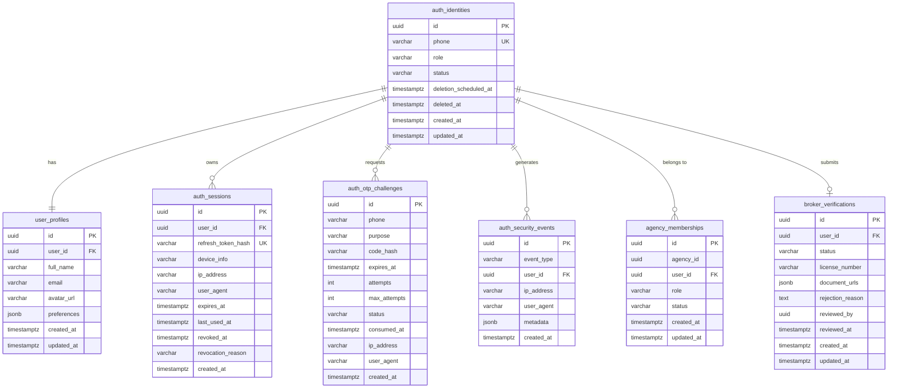

# Identity, Authentication, and Account Security Architecture

## 1. Executive Summary

This document specifies the authoritative implementation of **Step 04 — Authentication, Authorization, Identity, and Account Security** in the Zero Brokerage platform.

The backend serves as the sole source of truth for:

- User identity and account state
- Authentication credentials and session validity
- Platform roles and action permissions
- Agency membership and scope authorization
- Broker verification requirements
- Resource ownership enforcement
- Subscription entitlement integration
- Security audit events and distributed rate limiting
- Super Admin step-up challenge verification and sensitive action auditing
- Complete account deletion, cancellation, and retention lifecycle

---

## 2. Identity Data Model

The schema cleanly isolates distinct concerns into dedicated tables under versioned migrations (`20260928_002_create_identity_and_auth_tables.ts`):



---

## 3. Phone Authentication & OTP Lifecycle

1. **Phone Normalization**:
   - Every input is validated and normalized to canonical **E.164** format (e.g. `9876543210` -> `+919876543210`).
   - Normalization eliminates duplicate account creation from differing local notation formats.
2. **CSPRNG Generation & Storage**:
   - OTP codes are generated using cryptographically secure random integers (`crypto.randomInt(100000, 1000000)`).
   - Only HMAC-SHA256 hashes of codes (`code_hash`) are persisted. Raw OTPs are **never stored** in the database.
3. **Challenge Lifecycle & Single-Use Semantics**:
   - `PENDING`: Challenge created with 5-minute expiry (`OTP_EXPIRY_SECONDS = 300`).
   - `VERIFIED`: Transitioned atomically on successful verification.
   - `FAILED`: Transitioned automatically when max attempts (`OTP_MAX_ATTEMPTS = 3`) are exhausted.
   - `SUPERSEDED`: Existing active challenge invalidated when a new code is requested after cooldown.
   - `EXPIRED`: Evaluated if current time exceeds `expires_at`.
4. **Resend Cooldown**:
   - Enforces a 60-second cooldown (`OTP_RESEND_COOLDOWN_SECONDS`) between requests to prevent spam.
5. **Concurrency Safety**:
   - Atomic conditional SQL consumption (`UPDATE ... WHERE id = $1 AND status = 'PENDING' AND expires_at > NOW() AND attempts < max_attempts RETURNING id;`) guarantees single-use semantics and eliminates race conditions.
6. **Post-Deletion Guard**:
   - OTP requests and verification for permanently `DELETED` accounts are rejected immediately with `InvalidAccountStateError`.

---

## 4. Session & Token Architecture

Zero Brokerage utilizes a **Dual Token Strategy** (see [ADR 0002](../decisions/0002-session-and-token-strategy.md)):

- **Access Token (JWT)**:
  - 15 minutes lifetime.
  - Signed with HMAC-SHA256 (`JWT_SECRET`).
  - Verified statelessly for cryptography, then cross-checked against database `auth_sessions` state to guarantee immediate revocation and account suspension enforcement.
- **Refresh Token (Opaque CSPRNG)**:
  - 30-day sliding lifetime.
  - Persisted only as SHA-256 hashes (`refresh_token_hash`).
  - Rotated on every single refresh call (`/api/v1/auth/refresh`).
  - **Atomic Concurrency Protection**: Token rotation uses conditional database updates (`WHERE id = $3 AND refresh_token_hash = $4 AND revoked_at IS NULL AND expires_at > NOW()`). If two concurrent requests attempt to rotate with the same old token, exactly one succeeds and the competing request is rejected with HTTP 401.
  - **Replay Protection**: Reusing a previously revoked or rotated refresh token immediately fails with HTTP 401 and records a `SUSPICIOUS_ACTIVITY` security event.
- **Revocation Mechanisms**:
  - `POST /api/v1/auth/logout`: Revokes current active session.
  - `POST /api/v1/auth/logout-all`: Revokes all sessions for the user across all devices.
  - `POST /api/v1/auth/sessions/:id/revoke`: Selective remote session termination.

---

## 5. Role and Permission Authorization Layers

Zero Brokerage employs a layered authorization evaluation pipeline (see [ADR 0003](../decisions/0003-role-and-permission-matrix.md)):

1. **Authentication Layer**: Verifies active session token, valid identity, non-suspended account status.
2. **Platform Role Layer**: Verifies user holds `USER`, `INDEPENDENT_BROKER`, `AGENCY_BROKER`, `AGENCY_ADMIN`, or `SUPER_ADMIN`.
3. **Action Permission Layer**: Verifies role possesses specific action keys (e.g. `listing:create`, `admin:manage_settings`). Unrelated domain aliases (`SEARCH_EXPLORE`, `SAVED_MANAGE`, `LEADS_VIEW_ASSIGNED`) are strictly removed. Ownership permissions are removed from `SUPER_ADMIN`.
4. **Agency Membership Layer**:
   - Confirms active membership in target agency.
   - Verifies valid agency role (`ADMIN`, `MANAGER`, `BROKER`, `MEMBER`).
   - Verifies resource agency correlation.
5. **Broker Verification Layer**:
   - Distinguishes workflow statuses: `UNSUBMITTED`, `PENDING`, `APPROVED`, `REJECTED`, `SUSPENDED`, `REVERIFICATION_REQUIRED`.
   - Requires status = `APPROVED` before commercial broker listing/lead operations.
6. **Resource Ownership Layer**:
   - Verifies `authenticatedUserId === resourceOwnerId`.
   - Supports platform `SUPER_ADMIN` override where permitted by domain policy.
7. **Entitlement Layer**:
   - Authoritative backend subscription quota evaluation (`assertEntitlement`).
   - **Production Fail-Closed Safety**: In production, `DefaultEntitlementEvaluator` fails closed (`SUBSCRIPTION_SERVICE_UNCONFIGURED`) preventing fabricated production entitlements until Step 09 subscription billing is integrated.
8. **Super Admin Step-Up & Sensitive Action Layer**:
   - High-privilege administrative actions require step-up verification (`requireStepUp`, `requireSensitiveAdminAction`).

---

## 6. Super Admin Step-Up Authentication & Sensitive Action Auditing

Administrative privilege alone is never sufficient to execute high-impact operations.

### Step-Up Workflow

1. **Initiation**: Super Admin invokes `POST /api/v1/auth/step-up/request`. An OTP challenge with `purpose: "SENSITIVE_ACTION"` is generated and dispatched to the administrator's phone.
2. **Verification**: Admin submits OTP to `POST /api/v1/auth/step-up/verify`. Upon verification, the challenge is consumed, and a cryptographically signed, short-lived (5 minutes / 300 seconds) `stepUpToken` is issued.
3. **Token Binding & Distributed Replay Protection**:
   - The token binds `{ sub: userId, sessionId, challengeId, nonce, purpose: "STEP_UP", exp }`.
   - It is tied to the exact user and active session. Tokens cannot be used across different users or sessions.
   - **Distributed Atomic Consumption**: When submitted via header `x-step-up-token`, the nonce is consumed single-use across all horizontally scaled API instances via Redis using atomic `SET <step-up-nonce-key> 1 EX <TTL> NX` semantics (`RedisStepUpNonceStore`). The Redis key TTL is bounded to the token expiry and keys automatically expire.
   - **Replay Protection**: If two horizontally scaled API instances or concurrent requests attempt to consume the same nonce, only the first succeeds; the second receives an immediate HTTP 403 `SECURITY_CHALLENGE_REQUIRED` ("Step-up token has already been consumed.").
   - **Production Fail-Closed**: If Redis replay-protection storage is unavailable, unreachable, or fails, the verification fails closed with `SecurityChallengeRequiredError` ("Step-up verification service is temporarily unavailable. Request blocked for safety."). In-memory nonce storage is strictly forbidden in production.
   - **Shared Connection Composition**: The step-up service reuses the existing `ioredis` connection created by `RedisRateLimiter`, preventing connection leaks or redundant connection pools. The broader Redis plugin remains deferred to a subsequent milestone.
4. **Sensitive Action Auditing (`ADMIN_PRIVILEGE_USED`)**:
   - Guard `requireSensitiveAdminAction({ permission, action, resourceType, requiresStepUp: true })` validates permission, verifies step-up, and persists an `ADMIN_PRIVILEGE_USED` event.
   - **Metadata Sanitization**: `sanitizeAuditMetadata` scrubs passwords, OTPs, raw tokens, refresh tokens, secrets, credentials, and authorization headers before persistence.

---

## 7. Account Deletion Lifecycle & Retention Controls

1. **Deletion Request (`POST /api/v1/auth/delete-account`)**:
   - Marks account status as `DELETION_PENDING`.
   - Sets `deletion_scheduled_at` to 30 days in the future.
   - Anonymizes profile PII immediately (full name = `"Deleted User"`, email/avatar = `null`).
   - Immediately revokes active sessions with exact reason `ACCOUNT_DELETION_PENDING` (not `ACCOUNT_DELETED`).
   - Emits `ACCOUNT_DELETION_REQUESTED`.
2. **Cancellation During Grace Period (`POST /api/v1/auth/delete-account/cancel`)**:
   - Permitted only while status is `DELETION_PENDING` and deadline has not expired.
   - Restores status to `ACTIVE` and clears `deletion_scheduled_at`.
   - Permanently anonymized PII is **not restored**; user re-populates profile.
   - Emits `ACCOUNT_DELETION_CANCELLED`.
   - Rejected with `InvalidAccountStateError` if deadline has passed.
3. **Permanent Finalization (`POST /api/v1/auth/delete-account/finalize` & `finalizeExpiredAccountDeletions`)**:
   - Accounts whose 30-day retention schedule has expired are marked `DELETED`, with `deleted_at = NOW()`.
   - All active sessions are revoked (`ACCOUNT_DELETED`).
   - Idempotent: repeated calls succeed without error or duplicate deletion events.
   - Emits `ACCOUNT_DELETED`.
4. **Post-Deletion Authentication**:
   - Both OTP requests and verification for `DELETED` accounts are rejected with `InvalidAccountStateError("This account has been deleted.")`.

---

## 8. Distributed Rate Limiting Architecture

Zero Brokerage implements distributed rate limiting backed by Redis (`RedisRateLimiter`) using an atomic sliding-window algorithm executed via Lua:

```lua
local key = KEYS[1]
local now = tonumber(ARGV[1])
local windowMs = tonumber(ARGV[2])
local maxRequests = tonumber(ARGV[3])
local member = ARGV[4]
local clearBefore = now - windowMs

redis.call('ZREMRANGEBYSCORE', key, '-inf', clearBefore)
local currentCount = redis.call('ZCARD', key)

if currentCount < maxRequests then
    redis.call('ZADD', key, now, member)
    redis.call('PEXPIRE', key, windowMs)
    return {1, maxRequests - currentCount - 1, math.ceil(windowMs / 1000)}
else
    local oldest = redis.call('ZRANGE', key, 0, 0, 'WITHSCORES')
    local resetMs = windowMs
    if oldest and #oldest >= 2 then
        resetMs = math.max(0, (tonumber(oldest[2]) + windowMs) - now)
    end
    return {0, 0, math.ceil(resetMs / 1000)}
end
```

### Production Rules:

- **Shared Cluster State**: Quotas are shared across horizontally scaled API instances.
- **Strict Prohibition of Silent Fallback**: In production (`NODE_ENV === "production"`), missing `REDIS_URL` causes startup termination. Silent process-local fallback is prohibited.
- **Fail-Safe Behavior**: If Redis becomes unreachable, `failClosed = true` blocks requests to protect against credential brute force.
- **Fallback**: `InMemoryRateLimiter` is used strictly as a development and unit-test fallback.

### Rate Limit Quota Policy:

| Scope / Target             |   Window   |  Max Quota   | Action on Exceeded         |
| :------------------------- | :--------: | :----------: | :------------------------- |
| OTP Request (by Phone)     | 10 minutes |  3 requests  | HTTP 429 Too Many Requests |
| OTP Request (by IP)        | 60 minutes | 10 requests  | HTTP 429 Too Many Requests |
| OTP Verification (by IP)   | 10 minutes | 15 attempts  | HTTP 429 Too Many Requests |
| Global API Request (by IP) |  1 minute  | 120 requests | HTTP 429 Too Many Requests |

---

## 9. Security Event Catalog

Security events are immutably persisted in `auth_security_events`. Sensitive credentials (raw OTPs, JWT tokens, refresh tokens, passwords) are **strictly sanitized and never persisted**.

| Event Type                   | Trigger                           | Metadata Captured                                        |
| :--------------------------- | :-------------------------------- | :------------------------------------------------------- |
| `OTP_REQUESTED`              | User requests OTP code            | `challengeId`, masked `phone`, `purpose`                 |
| `OTP_VERIFIED`               | OTP code verified successfully    | `challengeId`, masked `phone`, `purpose`                 |
| `OTP_FAILED`                 | Incorrect OTP code entered        | `challengeId`, masked `phone`, `attempts`, `maxAttempts` |
| `SESSION_CREATED`            | New user session established      | `sessionId`, `deviceInfo`                                |
| `SESSION_REVOKED`            | Session logged out or revoked     | `sessionId`, `reason`                                    |
| `LOGOUT_ALL`                 | User terminates all sessions      | None                                                     |
| `SUSPICIOUS_ACTIVITY`        | Revoked token reuse or replay     | `sessionId`, `reason`                                    |
| `PHONE_CHANGE_REQUESTED`     | User requests phone number change | masked `newPhone`, `challengeId`                         |
| `PHONE_CHANGED`              | Phone change confirmed            | masked `newPhone`                                        |
| `ACCOUNT_DELETION_REQUESTED` | User schedules account deletion   | `reason`, `retentionExpiry`                              |
| `ACCOUNT_DELETION_CANCELLED` | User restores account             | `cancelledAt`                                            |
| `ACCOUNT_DELETED`            | Account permanently finalized     | `finalizedAt`                                            |
| `ADMIN_PRIVILEGE_USED`       | Super Admin sensitive action      | `action`, `resourceType`, `resourceId`, sanitized fields |

---

## 10. Route Matrix Summary

| Method | Endpoint                               | Auth Required | Description                                                |
| :----- | :------------------------------------- | :-----------: | :--------------------------------------------------------- |
| `POST` | `/api/v1/auth/request-otp`             |      No       | Request OTP challenge for phone login/registration.        |
| `POST` | `/api/v1/auth/verify-otp`              |      No       | Verify challenge code and exchange for token pair.         |
| `POST` | `/api/v1/auth/refresh`                 |      No       | Rotate refresh token and issue new token pair.             |
| `POST` | `/api/v1/auth/refresh-session`         |      No       | Alias for refresh endpoint.                                |
| `POST` | `/api/v1/auth/logout`                  |      Yes      | Invalidate current user session.                           |
| `POST` | `/api/v1/auth/logout-all`              |      Yes      | Invalidate all user sessions across devices.               |
| `GET`  | `/api/v1/auth/me`                      |      Yes      | Retrieve current user profile, roles, and permissions.     |
| `GET`  | `/api/v1/auth/sessions`                |      Yes      | List active sessions with masked IP and device info.       |
| `POST` | `/api/v1/auth/sessions/:id/revoke`     |      Yes      | Terminate specific user session.                           |
| `POST` | `/api/v1/auth/change-phone/request`    |      Yes      | Request OTP to verify new phone number.                    |
| `POST` | `/api/v1/auth/change-phone/confirm`    |      Yes      | Confirm phone change and revoke other sessions.            |
| `POST` | `/api/v1/auth/delete-account`          |      Yes      | Schedule account deletion with 30-day retention.           |
| `POST` | `/api/v1/auth/delete-account/cancel`   |      Yes      | Cancel scheduled deletion during grace period.             |
| `POST` | `/api/v1/auth/delete-account/finalize` |      Yes      | Permanently finalize expired account deletion.             |
| `POST` | `/api/v1/auth/step-up/request`         |      Yes      | Initiate sensitive action OTP challenge (Super Admin).     |
| `POST` | `/api/v1/auth/step-up/verify`          |      Yes      | Verify step-up OTP and issue short-lived single-use token. |
